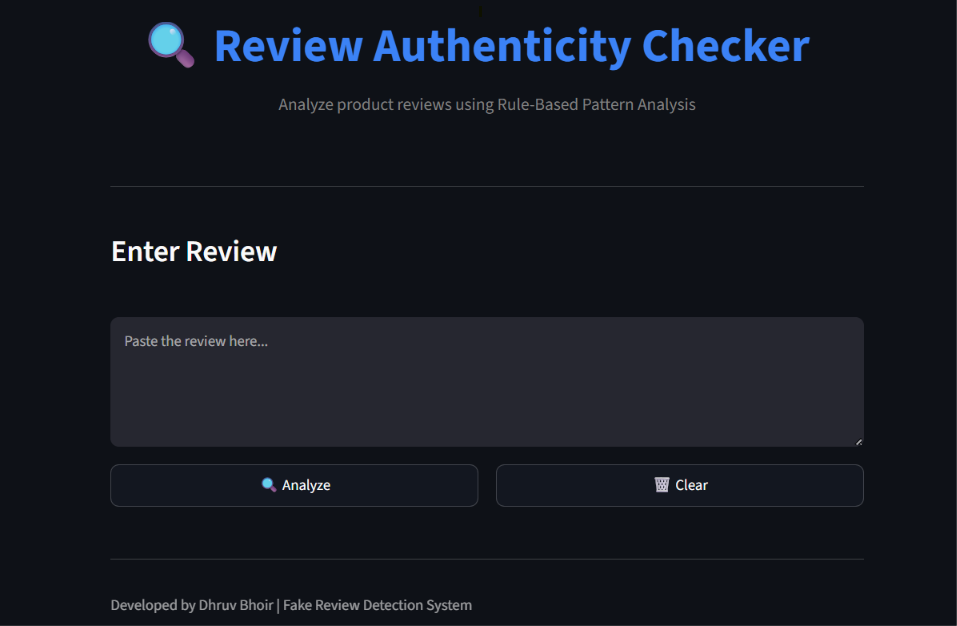
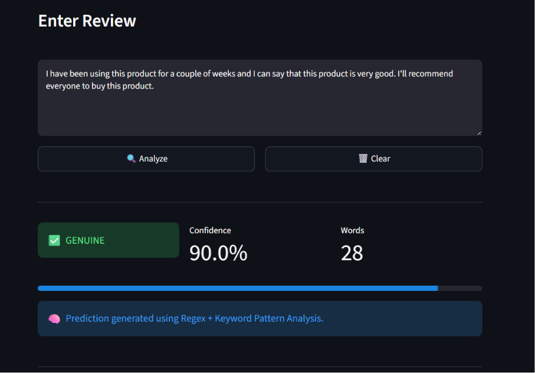
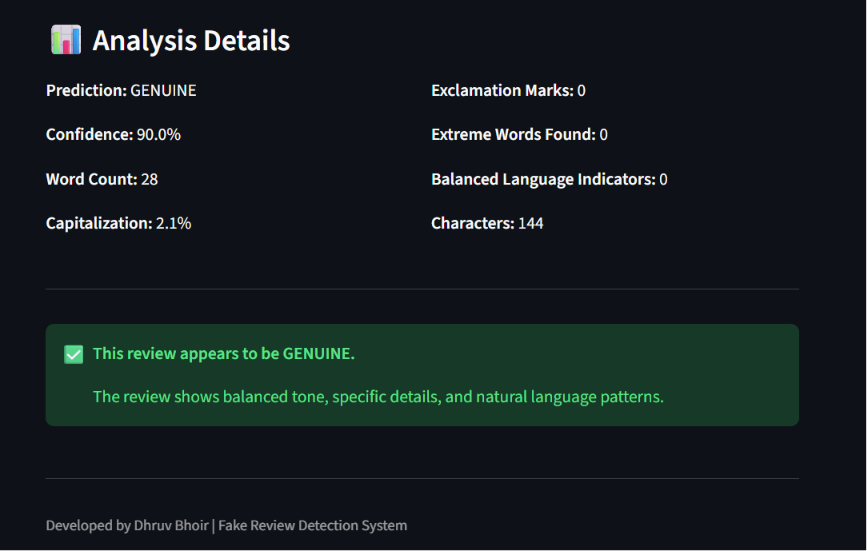

# 🔍 Fake Review Detection System


A Machine Learning-based web application that detects whether a product review is **Genuine** or **Fake** using Natural Language Processing (NLP) and TF-IDF vectorization. The application provides an intuitive Streamlit interface for real-time review analysis.

---

## 🌐 Live Demo

👉 **Live Application:** *https://fake-review-detection-system-ml.streamlit.app/*

---

## 📸 Screenshots

### 🏠 Home Page



### ✍️ Enter Review



### 📊 Result



---

## ✨ Features

- 🔍 Detects Fake and Genuine product reviews
- 🤖 Machine Learning-based prediction
- 📝 TF-IDF text vectorization
- 📊 Confidence score for every prediction
- 📈 Analysis details for each review
- 💻 Interactive Streamlit web interface
- ⚡ Fast and lightweight

---

## 🛠️ Tech Stack

- Python
- Streamlit
- Scikit-learn
- Joblib
- NLTK
- TF-IDF Vectorizer

---

## 📂 Project Structure

```text
fake-review-detection-system/
│
├── app.py
├── requirements.txt
├── fake_review_model.pkl
├── tfidf_vectorizer.pkl
├── screenshots/
│   ├── home.png
│   ├── enter-review.png
│   └── result.png
└── README.md
```

---

## ⚙️ Installation

Clone the repository

```bash
git clone https://github.com/dhruv-bhoir-ai/fake-review-detection-system.git
```

Move into the project folder

```bash
cd fake-review-detection-system
```

Install dependencies

```bash
pip install -r requirements.txt
```

Run the application

```bash
streamlit run app.py
```

---

## 🚀 How It Works

1. Enter a product review.
2. The review is converted into TF-IDF features.
3. The trained Machine Learning model predicts whether the review is Fake or Genuine.
4. The application displays:
   - Prediction
   - Confidence Score
   - Analysis Details

---

## 📊 Dataset

The model was trained on an e-commerce product review dataset containing both genuine and fake reviews. Reviews were preprocessed using NLP techniques and transformed using TF-IDF vectorization before training the machine learning model.

---

## 🔮 Future Improvements

- Deep Learning (LSTM/BERT)
- Explainable AI (SHAP/LIME)
- Multi-language review support
- Improved prediction accuracy
- API integration

---

## 👨‍💻 Author

**Dhruv Bhoir**

GitHub: https://github.com/dhruv-bhoir-ai

---

## ⭐ Support

If you found this project useful, consider giving it a ⭐ on GitHub.
